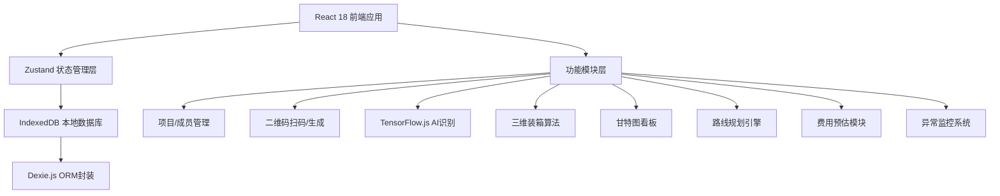
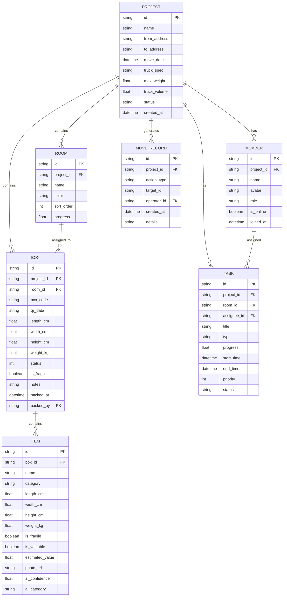

## 1. 架构设计



## 2. 技术说明
- **前端框架**：React@18 + TypeScript@5 + Vite@5
- **样式方案**：TailwindCSS@3 + CSS变量主题系统
- **状态管理**：Zustand@4（轻量级持久化状态）
- **本地数据库**：IndexedDB + Dexie.js@4（ORM封装层）
- **路由方案**：React Router DOM@6
- **图标库**：Lucide React@0.400
- **二维码**：qrcode.react@3（生成）+ html5-qrcode@2（扫描）
- **AI识别**：@tensorflow/tfjs@4 + @tensorflow-models/mobilenet@2
- **甘特图**：自定义Canvas实现（轻量化）
- **3D装箱可视化**：纯CSS 3D Transform + Canvas 2D等轴测投影

## 3. 路由定义
| 路由 | 页面用途 |
|------|----------|
| / | 项目列表首页，展示所有搬家项目 |
| /project/:id | 项目总览看板（甘特图+统计+异常） |
| /project/:id/members | 成员管理与邀请 |
| /project/:id/boxes | 纸箱与物品管理 |
| /project/:id/scan | 扫码+AI识别录入 |
| /project/:id/packing | 三维装箱规划与3D视图 |
| /project/:id/route | 路线规划与装载优先级 |
| /project/:id/cost | 费用预估与保险建议 |

## 4. 数据模型

### 4.1 数据模型ER图



### 4.2 IndexedDB表结构（Dexie Schema）

```typescript
// 数据库版本1 schema
db.version(1).stores({
  projects: 'id, name, status, created_at',
  members: 'id, project_id, role, name',
  rooms: 'id, project_id, sort_order',
  boxes: 'id, project_id, room_id, box_code, status, packed_at',
  items: 'id, box_id, category, is_fragile',
  tasks: 'id, project_id, room_id, assignee_id, status, priority',
  move_records: 'id, project_id, action_type, created_at'
});
```

## 5. 核心算法模块

### 5.1 三维装箱算法
- 采用「最高优先级底左」(Highest Priority Bottom-Left) 启发式算法
- 输入：货车三维尺寸(L/W/H)、最大载重，纸箱列表（尺寸+重量+优先级）
- 输出：每箱的3D坐标位置、装载顺序、空间利用率、载重分布
- 约束：载重平衡、底部承重、易碎品上层、房间聚类

### 5.2 路线规划算法
- 基于楼层+距离的权重计算
- 搬运顺序：先装远房间后装近房间（倒序卸货）
- 综合因素：电梯可用性、楼梯层数、物品重量等级

### 5.3 费用预估模型
- 基础费 = 货车规格基价 + 里程单价 × 距离
- 人工费 = 人数 × 小时单价 × 预估工时
- 保险费 = 物品总价值 × 保率(0.3%-1%分级)
- 材料费 = 纸箱数 × 单价 + 气泡膜/胶带估算

## 6. 权限控制矩阵
| 操作 | 负责人 | 协作成员 | 查看者 |
|------|--------|----------|--------|
| 创建/编辑项目 | ✅ | ❌ | ❌ |
| 邀请/移除成员 | ✅ | ❌ | ❌ |
| 变更角色 | ✅ | ❌ | ❌ |
| 添加/编辑纸箱 | ✅ | ✅ | ❌ |
| 录入物品+AI识别 | ✅ | ✅ | ❌ |
| 更新打包状态 | ✅ | ✅ | ❌ |
| 调整装箱方案 | ✅ | 仅建议 | ❌ |
| 确认费用方案 | ✅ | ❌ | ❌ |
| 查看看板/报表 | ✅ | ✅ | ✅ |
| 导出数据 | ✅ | ✅ | 仅PDF |

